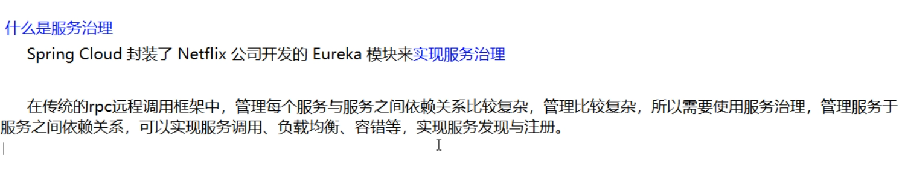
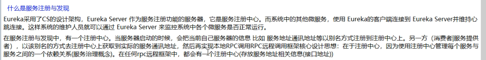

## 5.Eureka服务注册与发现

### Eureka基础知识

#### · 什么是服务治理



#### · 什么是服务注册




#### · Eureka两组件


### 单机Eureka构建步骤

#### · EurekaServer端

> #### IDEA生成EurekaServer端服务注册中心类似物业公司

##### 建Module

cloud-eureka-server7001

##### 改POM

```xml
<?xml version="1.0" encoding="UTF-8"?>
<project xmlns="http://maven.apache.org/POM/4.0.0"
         xmlns:xsi="http://www.w3.org/2001/XMLSchema-instance"
         xsi:schemaLocation="http://maven.apache.org/POM/4.0.0 http://maven.apache.org/xsd/maven-4.0.0.xsd">
    <parent>
        <artifactId>cloud2020</artifactId>
        <groupId>com.atguigu.springcloud</groupId>
        <version>1.0-SNAPSHOT</version>
    </parent>
    <modelVersion>4.0.0</modelVersion>

    <artifactId>cloud-eureka-server7001</artifactId>

    <dependencies>
        <!-- https://mvnrepository.com/artifact/org.springframework.cloud/spring-cloud-starter-eureka-server -->
        <dependency>
            <groupId>org.springframework.cloud</groupId>
            <artifactId>spring-cloud-starter-netflix-eureka-server</artifactId>
        </dependency>

        <dependency>
            <groupId>com.atguigu.springcloud</groupId>
            <artifactId>cloud-api-commons</artifactId>
            <version>${project.version}</version>
        </dependency>

        <!-- https://mvnrepository.com/artifact/org.springframework.boot/spring-boot-starter-web -->
        <dependency>
            <groupId>org.springframework.boot</groupId>
            <artifactId>spring-boot-starter-web</artifactId>
        </dependency>

        <!-- https://mvnrepository.com/artifact/org.springframework.boot/spring-boot-starter-web  -->
        <dependency>
            <groupId>org.springframework.boot</groupId>
            <artifactId>spring-boot-starter-actuator</artifactId>
        </dependency>

        <!-- https://mvnrepository.com/artifact/org.springframework.boot/spring-boot-devtools -->
        <dependency>
            <groupId>org.springframework.boot</groupId>
            <artifactId>spring-boot-devtools</artifactId>
            <scope>runtime</scope>
            <optional>true</optional>
        </dependency>

        <!-- https://mvnrepository.com/artifact/org.projectlombok/lombok -->
        <dependency>
            <groupId>org.projectlombok</groupId>
            <artifactId>lombok</artifactId>
        </dependency>

        <!-- https://mvnrepository.com/artifact/org.springframework.boot/spring-boot-starter-test -->
        <dependency>
            <groupId>org.springframework.boot</groupId>
            <artifactId>spring-boot-starter-test</artifactId>
            <scope>test</scope>
        </dependency>
        <dependency>
            <groupId>junit</groupId>
            <artifactId>junit</artifactId>
        </dependency>

    </dependencies>
</project>

```

> ###### 1.X和2.X的对比说明
>


##### 写YML

```yml
server:
  port: 7001

eureka:
  instance:
    hostname: localhost  #eureka服务端的实例名字
  client:
    register-with-eureka: false    #表识不向注册中心注册自己
    fetch-registry: false   #表示自己就是注册中心，职责是维护服务实例，并不需要去检索服务
     service-url:
      defaultZone: http://${eureka.instance.hostname}:${server.port}/eureka/    #设置与eureka server交互的地址查询服务和注册服务都需要依赖这个地址
```

##### 主启动

```java
package com.atguigu.springcloud;

import org.springframework.boot.SpringApplication;
import org.springframework.boot.autoconfigure.SpringBootApplication;
import org.springframework.cloud.netflix.eureka.server.EnableEurekaServer;

@EnableEurekaServer
@SpringBootApplication
public class EurekaMain7001 {
    public static void main(String[] args) {
        SpringApplication.run(EurekaMain7001.class,args);
    }
}
```

> ###### @EnableEurekaServer
>

##### 测试

http://localhost:7001/


#### · EurekaClient端

将注册进EurekaServer成为服务提供者provider，类似尚硅谷学校对外提供授课服务

##### cloud-provider-payment8001

##### 改POM

```xml
 <!-- https://mvnrepository.com/artifact/org.springframework.cloud/spring-cloud-starter-eureka-server -->
        <dependency>
            <groupId>org.springframework.cloud</groupId>
            <artifactId>spring-cloud-starter-netflix-eureka-client</artifactId>
        </dependency>
```

> ###### 1.X和2.X的对比说明
>


##### 写YML

```yml
eureka:
  client:
    register-with-eureka: true
    fetchRegistry: true
    service-url:
      defaultZone: http://localhost:7001/eureka
```

##### 主启动

```java
package com.atguigu.springcloud;

import org.springframework.boot.SpringApplication;
import org.springframework.boot.autoconfigure.SpringBootApplication;
import org.springframework.cloud.netflix.eureka.EnableEurekaClient;

@EnableEurekaClient
@SpringBootApplication
public class PaymentMain8001 {
    public static void main(String[] args) {
        SpringApplication.run(PaymentMain8001.class,args);
    }
}
```

> ###### @EnableEurekaClient
>

##### 测试

###### 先要启动EurekaServer

http://localhost:7001/


###### 微服务注册名配置说明


###### 自我保护机制


#### · EurekaClient端

将注册进EurekaServer成为服务消费者consumer,类似来尚硅谷上课消费的各位同学

##### cloud-provider-payment80

##### 改POM

```xml
 <!-- https://mvnrepository.com/artifact/org.springframework.cloud/spring-cloud-starter-eureka-server -->
        <dependency>
            <groupId>org.springframework.cloud</groupId>
            <artifactId>spring-cloud-starter-netflix-eureka-client</artifactId>
        </dependency>
```

##### 写YML

```yml
spring:
  application:
    name: cloud-order-service

eureka:
  client:
    register-with-eureka: true
    fetchRegistry: true
    service-url:
      defaultZone: http://localhost:7001/eureka
```

##### 主启动

```java
package com.atguigu.springcloud;

import org.springframework.boot.SpringApplication;
import org.springframework.boot.autoconfigure.SpringBootApplication;
import org.springframework.cloud.netflix.eureka.EnableEurekaClient;

@EnableEurekaClient
@SpringBootApplication
public class PaymentMain8001 {
    public static void main(String[] args) {
        SpringApplication.run(PaymentMain8001.class,args);
    }
}
```

> ###### @EnableEurekaClient
>

##### 测试

###### 先要启动EurekaServer

###### 再要启动服务提供者provider，8001服务

###### eureka服务器


###### http://localhost/consumer/payment/get/31

### 集群Eureka构建步骤

#### Eureka集群原理说明


#### EurekaServer集群环境构建步骤

##### 参考cloud-eureka-server7001

##### 新建cloud-eureka-server7002

##### 改POM

##### 修改映射配置

找到C:\Windows\System32\drivers\etc路径下的hosts文件


###### 修改映射配置添加进hosts文件

127.0.0.1  eureka7001.com

127.0.0.1  eureka7002.com

##### 写YML（以前单机）


7001

```yml
server:
  port: 7001

eureka:
  instance:
    hostname: eureka7001.com    #eureka服务端的实例名字
  client:
    register-with-eureka: false    #表识不向注册中心注册自己
    fetch-registry: false   #表示自己就是注册中心，职责是维护服务实例，并不需要去检索服务
    service-url:
      defaultZone: http://eureka7002.com:7002/eureka/    #设置与eureka server交互的地址查询服务和注册服务都需要依赖这个地址
```

7001

```yml
server:
  port: 7002

eureka:
  instance:
    hostname: eureka7002.com #eureka服务端的实例名字
  client:
    register-with-eureka: false    #表识不向注册中心注册自己
    fetch-registry: false   #表示自己就是注册中心，职责是维护服务实例，并不需要去检索服务
    service-url:
      defaultZone: http://eureka7001.com:7001/eureka/     #设置与eureka server交互的地址查询服务和注册服务都需要依赖这个地址
 
```

##### 主启动(复制cloud-eureka-server7001的主启动类到7002即可)

#### 将支付服务8001微服务发布到上面2台Eureka集群配置中

##### YML

```yml
service-url:
  defaultZone: http://eureka7001.com:7001/eureka,http://eureka7002.com:7002/eureka  #集群版
```

#### 将订单服务80微服务发布到上面2台Eureka集群配置中

##### YML

```yml
service-url:
  defaultZone: http://eureka7001.com:7001/eureka,http://eureka7002.com:7002/eureka  #集群版
```

#### 测试01

- 先要启动EurekaServer，7001/7002服务
- 再要启动服务提供者provider，8001服务
- 再要启动消费者，80
- http://localhost:8080/consumer/payment/get/31

#### 支付服务提供者8001集群环境构建

参考cloud-provider-payment8001

新建cloud-provider-payment8002

##### 改POM

##### 写YML


7001

```yml
server:
  port: 7001

eureka:
  instance:
    hostname: eureka7001.com    #eureka服务端的实例名字
  client:
    register-with-eureka: false    #表识不向注册中心注册自己
    fetch-registry: false   #表示自己就是注册中心，职责是维护服务实例，并不需要去检索服务
    service-url:
      defaultZone: http://eureka7002.com:7002/eureka/    #设置与eureka server交互的地址查询服务和注册服务都需要依赖这个地址
      
```

7002

```yml
server:
  port: 7002

eureka:
  instance:
    hostname: eureka7002.com #eureka服务端的实例名字
  client:
    register-with-eureka: false    #表识不向注册中心注册自己
    fetch-registry: false   #表示自己就是注册中心，职责是维护服务实例，并不需要去检索服务
    service-url:
      defaultZone: http://eureka7001.com:7001/eureka/     #设置与eureka server交互的地址查询服务和注册服务都需要依赖这个地址

```

##### 

##### 主启动类

找到C:\Windows\System32\drivers\etc路径下的hosts文件


###### 修改映射配置添加进hosts文件

127.0.0.1  eureka7001.com

127.0.0.1  eureka7002.com


##### 修改8001/8002的Controller

###### 8001


###### 8002


#### 负载均衡

##### bug

订单服务访问地址不能写死

```java

改为这个：
public static final String PAYMENT_URL = "http://CLOUD-PAYMENT-SERVICE";
 
```

> ###### 使用@LoadBalanced注解赋予RestTemplate负载均衡的能力

##### ApplicationContextBean

提前说一下Ribbon的负载均衡功能

#### 测试

- 先要启动EurekaServer，7001/7002服务

- 再要启动服务提供者provider，8001/8002服务

- http://localhost/consumer/payment/get/31

- 结果

  负载均衡效果达到

  8001/8002端口交替出现

- Ribbon和Eureka整合后Consumer可以直接调用服务而不用再关心地址和端口号，且该服务还有负载功能了

### actuator微服务信息完善

#### 主机名称：服务名称修改

##### 当前问题

##### loud-provider-payment8001

YML修改部分

```yml
instance:
    instance-id: payment8001
```

效果


#### 访问信息有ip信息提示

##### 当前问题

没有ip提示

##### 修改cloud-provider-payment8001

YML修改部分

```yml
prefer-ip-address: true 
```

完整内容

```yml
eureka:
  client:
    register-with-eureka: true
    fetchRegistry: true
    service-url:
      defaultZone: http://eureka7001.com:7001/eureka,http://eureka7002.com:7002/eureka  #集群版
  instance:
    instance-id: payment8001
    prefer-ip-address: true
```


### 服务发现Discovery

对于注册进eureka里面的微服务，可以通过服务发现来获得该服务的信息

#### 修改cloud-provider-payment8001的Controller

```java
@Resource
private DiscoveryClient discoveryClient;
 
 
@GetMapping(value = "/payment/discovery")
public Object discovery(){
    List<String> services = discoveryClient.getServices();
    for (String element : services) {
        log.info("***** element:"+element);
    }
    List<ServiceInstance> instances = discoveryClient.getInstances("CLOUD-PAYMENT-SERVICE");
    for (ServiceInstance instance : instances) {
        log.info(instance.getServiceId()+"\t"+instance.getHost()+"\t"+instance.getPort()+"\t"+instance.getUri());
    }
    return this.discoveryClient;
}
```

#### 8001主启动类

@EnableDiscoveryClient

#### 自测

- 先要启动EurekaServer，7001/7002服务
- 再启动8001主启动类，需要稍等一会
- http://localhost:8001/payment/discovery


### Eureka自我保护

#### 故障现象


#### 导致原因


> 一句话：某时刻某一个微服务不可用了，Eureka不会立刻清理，依旧会对该微服务的信息进行保存

属于CAP里面的AP分支

#### 怎么禁止自我保护（一般生产环境中不会禁止自我保护）

##### 注册中心eureakeServer端7001

###### 出厂默认，自我保护机制是开启的

eureka.server.enable-self-preservation = true

###### 使用eureka.server.enable-self-preservation = false可以禁用自我保护模式

```yml
server:
  enable-self-preservation: false
  eviction-interval-timer-in-ms: 2000
```

###### 关闭效果

###### 在eurekaServer端7001处设置关闭自我保护机制

##### 生产者客户端eureakeClient端8001

###### 默认

- **eureka.instance.lease-renewal-interval-in-seconds=30**

  单位为秒（默认是30秒）

- **eureka.instance.lease-expiration-duration-in-seconds=90**

  单位为秒（默认是90秒）

###### 配置

```yml
instance:
    lease-renewal-interval-in-seconds:  1
   lease-expiration-duration-in-seconds:  2
```


###### 测试

1. 7001和8001都配置完成

2. 先启动7001再启动8001

3. 先关闭8001

   马上被删除了

## 15.SpringCloud Stream消息驱动

### 消息驱动概述

### 案例说明

### 消息驱动之生产者

### 消息驱动之消费者

### 分组消费与持久化


## 16.SpringCloud Sleuth分布式请求链路追踪

### 概述

> 为什么会出现这个技术？需要解决哪些问题？

在微服务框架中，一个由客户端发起的请求在后端系统中会经过多个不同的服务节点调用来协同产生最后的请求结果，每一个前段请求都会形成一条复杂的分布式服务调用链路，链路中的任何一环出现高延时或错误都会引起整个请求最后的失败。

#### 是什么

https://github.com/spring-cloud/spring-cloud-sleuth

Spring Cloud Sleuth提供了一套完整的服务跟踪的解决方案，在分布式系统中提供追踪解决方案并且兼容支持了zipkin

#### 解决


### 搭建链路监控步骤

#### 1.zipkin

#####        下载

SpringCloud从F版起已不需要自己构建Zipkin server了，只需要调用jar包即可

https://dl.bintray.com/openzipkin/maven/io/zipkin/java/zipkin-server/

zipkin-server-2.12.9.exec.jar

#####         运行jar

java -jar zipkin-server-2.12.9-exec.jar


##### 运行控制台

http://localhost:9411/zipkin/

**完整的调用链路**

表示一请求链路，一条链路通过Trace Id唯一标识，Span标识发起的请求信息，各span通过parent Id 关联起来

 

##### **上图拆分**


> **Trace:** 类似于树结构的Span集合，表示一条调用链路，存在唯一标识
>
> **span:** 表示调用链路来源，通俗的理解span就是一次请求信息

#### 2.服务提供者

##### · cloud-provider-payment8001

##### · POM

```xml
<!--包含了sleuth+zipkin-->
        <dependency>
            <groupId>org.springframework.cloud</groupId>
            <artifactId>spring-cloud-starter-zipkin</artifactId>
        </dependency>
```

##### · YML

```yml
server:
  port: 8001


spring:
  application:
    name: cloud-payment-service
  zipkin:
    base-url: http://localhost:9411
  sleuth:
    sampler:
    probability: 1
  datasource:
    type: com.alibaba.druid.pool.DruidDataSource
    driver-class-name: org.gjt.mm.mysql.Driver
    url: 
    username: root
    password: 

mybatis:
  mapperLocations: classpath:mapper/*.xml
  type-aliases-package: com.atguigu.springcloud.entities


eureka:
  client:
    register-with-eureka: true
    fetchRegistry: true
    service-url:
      defaultZone: http://eureka7001.com:7001/eureka,http://eureka7002.com:7002/eureka  #集群版
  instance:
    instance-id: payment8001
    prefer-ip-address: true
 
```

##### · 业务类PaymentController

```java
package com.atguigu.springcloud.controller;
 
import com.atguigu.springcloud.entities.CommonResult;
import com.atguigu.springcloud.entities.Payment;
import com.atguigu.springcloud.service.PaymentService;
import lombok.extern.slf4j.Slf4j;
import org.springframework.beans.factory.annotation.Value;
import org.springframework.cloud.client.ServiceInstance;
import org.springframework.web.bind.annotation.*;
import org.springframework.cloud.client.discovery.DiscoveryClient;
 
import javax.annotation.Resource;
import java.util.List;
import java.util.concurrent.TimeUnit;
 
 
@RestController
@Slf4j
public class PaymentController
{
    @Resource
    private PaymentService paymentService;
 
    @Value("${server.port}")
    private String serverPort;
 
    @Resource
    private DiscoveryClient discoveryClient;
 
    @PostMapping(value = "/payment/create")
    public CommonResult create(@RequestBody Payment payment)
    {
        int result = paymentService.create(payment);
        log.info("*****插入结果："+result);
 
        if(result > 0)
        {
            return new CommonResult(200,"插入数据库成功,serverPort: "+serverPort,result);
        }else{
            return new CommonResult(444,"插入数据库失败",null);
        }
    }
 
    @GetMapping(value = "/payment/get/{id}")
    public CommonResult<Payment> getPaymentById(@PathVariable("id") Long id)
    {
        Payment payment = paymentService.getPaymentById(id);
 
        if(payment != null)
        {
            return new CommonResult(200,"查询成功,serverPort:  "+serverPort,payment);
        }else{
            return new CommonResult(444,"没有对应记录,查询ID: "+id,null);
        }
    }
 
    @GetMapping(value = "/payment/discovery")
    public Object discovery()
    {
        List<String> services = discoveryClient.getServices();
        for (String element : services) {
            log.info("*****element: "+element);
        }
 
        List<ServiceInstance> instances = discoveryClient.getInstances("CLOUD-PAYMENT-SERVICE");
        for (ServiceInstance instance : instances) {
            log.info(instance.getServiceId()+"\t"+instance.getHost()+"\t"+instance.getPort()+"\t"+instance.getUri());
        }
 
        return this.discoveryClient;
    }
 
    @GetMapping(value = "/payment/lb")
    public String getPaymentLB()
    {
        return serverPort;
    }
 
    @GetMapping(value = "/payment/feign/timeout")
    public String paymentFeignTimeout()
    {
        // 业务逻辑处理正确，但是需要耗费3秒钟
        try { TimeUnit.SECONDS.sleep(3); } catch (InterruptedException e) { e.printStackTrace(); }
        return serverPort;
    }
 
    @GetMapping("/payment/zipkin")
    public String paymentZipkin()
    {
        return "hi ,i'am paymentzipkin server fall back，welcome to atguigu，O(∩_∩)O哈哈~";
    }
}
```

#### 3.服务消费者（调用方）

##### · cloud-consumer-order80

##### · POM

```xml
 <!--包含了sleuth+zipkin-->
        <dependency>
            <groupId>org.springframework.cloud</groupId>
            <artifactId>spring-cloud-starter-zipkin</artifactId>
        </dependency>
```

##### · YML

```yml
server:
  port: 80
 
spring:
    application:
        name: cloud-order-service
    zipkin:
      base-url: http://localhost:9411
    sleuth:
      sampler:
        probability: 1
 
eureka:
  client:
    #表示是否将自己注册进EurekaServer默认为true。
    register-with-eureka: false
    #是否从EurekaServer抓取已有的注册信息，默认为true。单节点无所谓，集群必须设置为true才能配合ribbon使用负载均衡
    fetchRegistry: true
    service-url:
      #单机
      #defaultZone: http://localhost:7001/eureka
      # 集群
      defaultZone: http://eureka7001.com:7001/eureka,http://eureka7002.com:7002/eureka  # 集群版
```

##### · 业务类OrderController

```java
 // ====================> zipkin+sleuth
    @GetMapping("/consumer/payment/zipkin")
    public String paymentZipkin()
    {
        String result = restTemplate.getForObject("http://localhost:8001"+"/payment/zipkin/", String.class);
        return result;
    }
```

#### 4.依次启动eureka7001/8001/80

80调用8001几次测试下

#### 5.打开浏览器访问:http:localhost:9411

会出现以下界面


**查看**


**查看依赖关系**

**原理**

